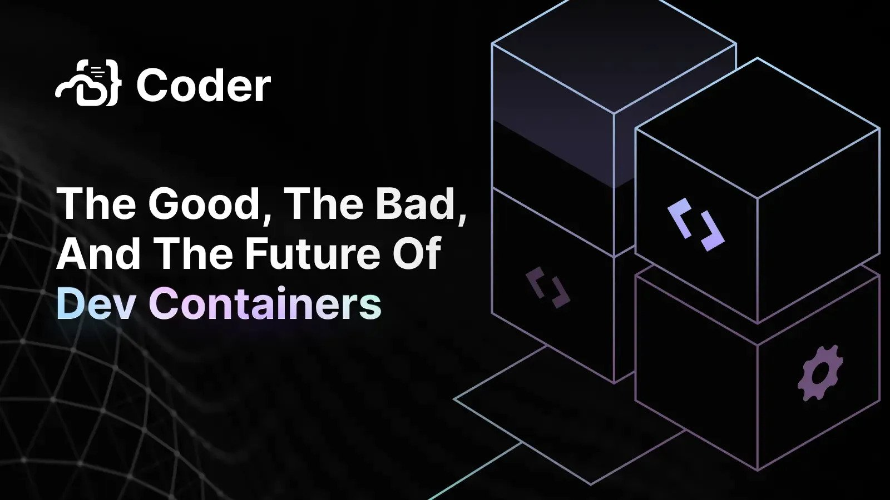

> **Info**
> August 29th @ 10am PDT. [Register here!](http://cdr.co/zMzI2MA)

Join us as we break down the good, the bad, the future of Dev Containers. In this webinar we’ll explore:

- Reproducible development environments. From heightened development efficiency to eradicating the age-old "It works on my machine" dilemma, Dev Containers hold the promise of a consistent and streamlined development journey.
- Dive into the popularity of Dev Containers. Understand potential roadblocks, from resource demands to learning curves. Tackle security concerns with best practices derived from the experiences of industry experts.
- Walk away with resources and discover multiple ways to leverage Dev Containers, along with potentially faster alternatives for organizations.

## Links

- [VS Code Dev Containers Extension](https://marketplace.visualstudio.com/items?itemName=ms-vscode-remote.remote-containers)
- [Coder's Envbuilder](https://github.com/coder/envbuilder)
- [containers.dev Official Site](https://containers.dev)
- [Coder Docker Dev Container Template](https://github.com/coder/coder/tree/main/examples/templates/devcontainer-docker)
- [Coder Kubernetes Dev Container Template](https://github.com/coder/coder/tree/main/examples/templates/devcontainer-kubernetes)

## Images

  
  

