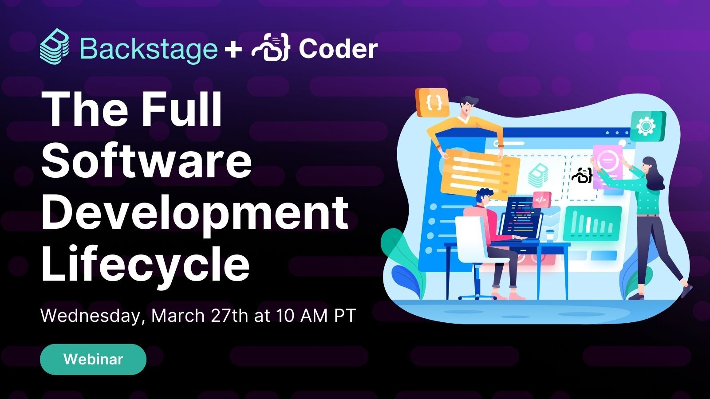

> **Info**
> March 26th @ 10am PDT. [Register here!](http://cdr.co/yNjg3OA)

# Backstage + Coder: The Full Software Development Lifecycle

Learn how to use Backstage and Coder together to build a golden path from day one, covering everything from the inner development loop to environment management and maintenance.
In this webinar, we'll explore:

- Intro to Backstage and Coder
- Installing and using the Coder Backstage plugin
- Installing and using the Dev Containers Backstage Plugin
- Best practices for usage and adoption